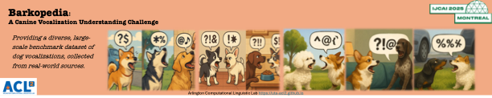

# Barkopedia: A Canine Vocalization Understanding Challenge <!-- omit from toc -->

## 📣 Updates

**2025-04-15**  
- Competition officially launches; training data is released.

## 📊 Overview

Dogs use vocalizations to communicate intentions, emotions, and contextual cues. While prior research shows that machine learning models can classify dog barks based on context, individual identity, and emotion, existing studies often suffer from limited scale, generalizability, or robustness due to small datasets or handcrafted features.

This challenge, hosted at [IJCAI 2025](https://2025.ijcai.org/), addresses these issues by providing a large-scale, diverse benchmark dataset of real-world dog vocalizations sourced from YouTube and Reddit. The competition includes eight tasks designed to promote research at the intersection of machine learning, audio/speech processing, and animal communication.

The competition results, dataset, leaderboard, and result submissions are all hosted on Hugging Face. So if you don’t have a Hugging Face account yet, please register for one. Then sign up here to participate and stay informed: [Registration Form](https://forms.office.com/r/0ZmFjYnW2p)

Each task will accept up to 20 participating teams. Each team may compete in multiple tasks, and may submit multiple entries to each task.

Top-performing teams on the Leaderboard will be invited to **present their solutions** and receive a
certificate at IJCAI 2025.

<!-- ## 🥇 Detailed Leaderboard
[Public Leaderboard](https://safe-challenge-leaderboard-public.hf.space)
<iframe
	src="https://safe-challenge-leaderboard-public.hf.space"
	frameborder="0"
	width="850"
	height="450"
></iframe> 
-->

## Registration

**Registration is required to participate:**
- Sign up: [Registration Form](https://forms.office.com/r/0ZmFjYnW2p)
- Contact us: uta.acl2@gmail.com (please include Barkopedia in the subject line)
- Open an issue: [GitHub Repo](https://github.com/uta-acl2/Barkopedia)

## 📜 Important Dates

- **04/15/2025:** Competition opens for registration and training data release  
- **06/01/2025:** Validation data and baseline results released  
- **06/15/2025:** Registration deadline  
- **07/01/2025:** Submission portal opens for test data  
- **07/15/2025:** Final submission deadline  
- **08/01/2025:** Preliminary results announced; feedback period opens  
- **08/15/2025:** Deadline for challenge reports and code submission
  
+ **08/15/2025:** Final results and winner announcement  
+ **Presentation of winning solutions at IJCAI 2025** (Detailed time will be announced as soon as possible)

For questions regarding this challenge, please contact: **uta.acl2@gmail.com** (with Barkopedia
in the subject line)

## 📝 Tasks

The competition includes eight tasks. The first six involve classifying dog vocalization by categories such as individual, breed, sex, age, environment, etc. The last two tasks focuses on audio denoising to extract clean dog barks from noisy recordings (either as a sound source separation or sound event
detection task). All tasks are open simultaneously.

- **Task 1 (✅ Open):** [Dog Age Group Classification](https://huggingface.co/spaces/ArlingtonCL2/BarkopediaDogAgeGroupClassification)

- **Task 2 (✅ Open):** [Dog Sex Classification](https://huggingface.co/spaces/ArlingtonCL2/BarkopediaDogSexClassification)

- **Task 3 (✅ Open):** [Dog Breed Classification](https://huggingface.co/spaces/ArlingtonCL2/BarkopediaDogBreedClassification)

- **Task 4 (✅ Open):** [Individual Dog Recognition](https://huggingface.co/spaces/ArlingtonCL2/BarkopediaIndividualDogRecognition)

- **Task 5 (✅ Open):** [Dog Activity & Environment Classification](https://huggingface.co/spaces/ArlingtonCL2/Barkopedia_DogActivityEnvironmentClassification)

- **Task 6 (✅ Open):** [Dog Emotion Classification](https://huggingface.co/spaces/ArlingtonCL2/BarkopediaDogEmotionClassification)

- **Task 7 (✅ Open):** [Dog Vocal Separation (DVS)](https://huggingface.co/spaces/ArlingtonCL2/Barkopedia-Dog_Vocal_Separation)

- **Task 8 (✅ Open):** [Dog Vocal Detection (DVD)](https://huggingface.co/spaces/ArlingtonCL2/BarkopediaDogVocalDetectionChallenge)

## 📈 Data

Each task includes a corresponding dataset with a dataset card available on its Hugging Face page.

## 🤖 Result Submission

In each specific competition page, click bottom left button `Login with Hugging Face` to grant the credential and submit your submission file. Please follow the instruction of each specific challenge in HuggingFace.

